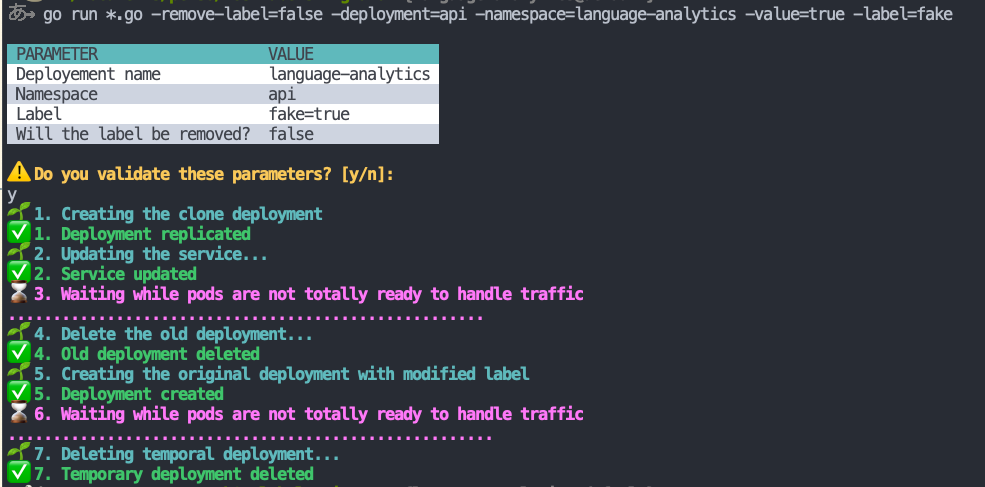

# kubernetes-labels-migrator

## Installation

### MacOS

```bash
brew tap tchoupinax/brew
brew install tchoupinax/brew/kubernetes-labels-migrator
```

## Usage

### Disclaimer

⚠️ The software is provided "as is" and you use it as your own risk. I made the best thing I could do but maybe there is a bug somewhere or your configuration has a edge case I did not anticipate. In this readme, a section describes all what is executed. The code is open, pretty short and simple so please give a look about what it is done and above all, **test outside of production**. It's a good practice.

### CLI

If you need help, the help flag can show you available flags (`kubernetes-labels-migrator -help`).

```bash
kubernetes-labels-migrator \
      -deployment="my-application" \
      -label="kubernetes.io/app" \
      -namespace="default" \
      -value="my-application"
```



## Tutorial

Let's say you are managing your application with the gitops's philosohpy ([ArgoCD](https://argo-cd.readthedocs.io/en/stable/) is really great to do the job). You want to add or edit a label. This difference has already been done by your code but ArgoCD refused to sync because of the "immutable field" error. Then following this:
- ⚠️ First of all, nothing intervene during the operation! `kubernetes-labels-migrator` should be free until the end. If you have tools like ArgoCD that synchronize your resources, **please** ensure this feature is **disabled**.
- You can commit the changes on the resource and observe the difference
- Launch the script and watch the magic happens
- According your changes, the difference should have been resolved

## Motivation

Deployment's labels are immutable. That means, if you have to edit, rename or add labels to a deployed application, you have to delete the deployment. On a production application, it is very annoying.

To be able to add labels without any downtime, we have to use a [blue-green strategy](https://www.redhat.com/en/topics/devops/what-is-blue-green-deployment). This projects aims to do this operation automatically and without human manual operation. The production must be safe!

## Explanations

Labels are immutable by design but moreover they can be used as selector for a service. That means if you break a label, you could cut the link between a Kubernetes service and a pod. That definitively not something you want to happen in your production. To prevent from meeting this issue, we make this operation.

We have a deployment called `api` with labels `app=api` and `kubernetes.io/name=Api`. However, this label is bad typed and should be totally in lowercase. So we want to rename it. A service, called `api` too, targets pods with labels `app=api` `kubernetes.io/name=Api`.

1. **Clone deployment**: we will create the same deployment, called the same and suffixed by `changing-label-tmp`. This deployment won't have the label we want to edit or remove (here it's `kubernetes.io/name`).
2. **Edit the service**: we will update the service to set selectors to match a subset of labels that matches both deployment. It's mandatory to ensure the service will loadbalance traffic between pods accross both deployment.
3. **Wait all pods are ready**: you might know that Kubernetes waits until a pod is alive (liveness) and ready (readyness) to send traffic to it. That the goal here and we are querying Kubernetes's API to ensure both deployment have all of their pod ready.
4. **Delete the old deployment**: as we want to rewrite label, we have to delete and create again the deployment. Labels are immutable and it's the **only way** to do it.
5. **Create the deployment with new label**: this deployment has all final labels but continue to work with the current service. Remember this service targets a subset of selector.
6. **Wait all pods are ready**: we repeat the operation about the new deployment.
7. **Remove temporary deployment**: now that the deployment is ready, we can cut the temporary one and leaves in place the new deployment with modified label.
8. **[Optional] Add the label to service selector**: some labels are recommenced by Kubernetes to be present as default label and thoses labels might be added to the service selector. That means we are making the matching set stronger.
      - See [documentation](https://kubernetes.io/docs/concepts/overview/working-with-objects/common-labels/)
      - For the moment, only `kubernetes.io/name` is considered to be added to the service

## Zero downtime testing

Using [Vegeta](https://github.com/tsenart/vegeta), we can overload the service to detect if one or more request is thrown during the process.

⚠️ During the process, pods and service will be updated, that means if you expect to port-forward the service, the connection will be lost during the migration. We suggest you to target an `Ingress` or any others way to reach the service.

### Monitoring from your terminal

#### Requirements

The following command requires two projects to work:

- [jplot](https://github.com/rs/jplot)
- [jaggr](https://github.com/rs/jaggr)

To install these project, you can enter these commands:

```bash
# MacOS
brew install rs/tap/jplot
brew install rs/tap/jaggr
```

Then, enter this command

```
echo 'GET YOUR_URL' | \
    vegeta attack -rate 200 -duration 10m | vegeta encode | \
    jaggr @count=rps \
          hist\[100,200,300,400,500\]:code \
          p25,p50,p95:latency \
          sum:bytes_in \
          sum:bytes_out | \
    jplot rps+code.hist.100+code.hist.200+code.hist.300+code.hist.400+code.hist.500 \
          latency.p95+latency.p50+latency.p25 \
          bytes_in.sum+bytes_out.sum
```

## Roadmap

1.0.0
- [ ] Sucessful migration in production with relatively high volume
- [ ] Handle the fact the edited label is the only one used for the service
- [ ] Documentation about potentials issues from scale (DB)
- [ ] Better handling of labels added to the service and well understand of K8S's good pratices

0.1.0
- [x] Successful test with zero downtime
- [x] Basic documentation
